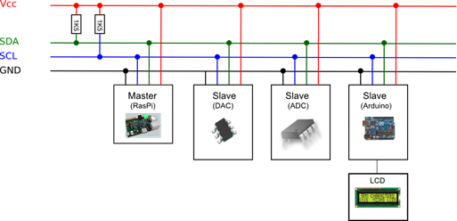
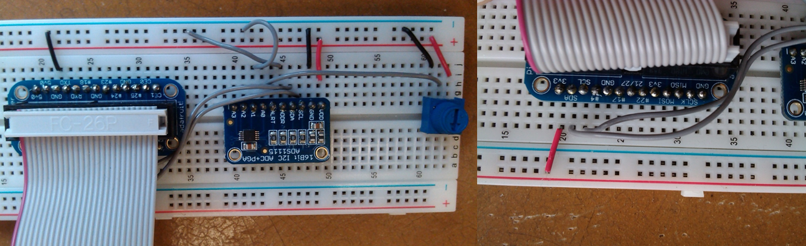
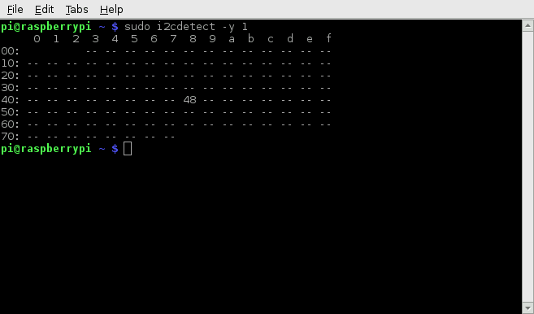

1 Introduction and Aims
=======================

The following set of tutorials will provide a basic introduction to
using the Raspberry Pi for data acquisition (DAQ). The tutorials are
split into two main groups:

* Although the Raspberry Pi has numerous GPIO
(General-Purpose-Input-Output) pins, it does not contain an ADC
(Analog-Digital Converter). This means that by itself the Pi is unable
to sample an analog voltage. The first set of tutorials involve
interfacing an ADC to the Pi (the Ti ADS1115), and using this device to
sample an analog voltage

* As discussed shortly, there are limitations of using the Pi combined
with the ADS1115 to sample data. The second set of Tutorials will
involve interfacing the Pi with a microcontroller (an ATMega328 on the
Arduino Uno), where the ADC is used to sample data, which is then
transmitted to the Pi

The tutorials are primarily aimed at those needing to do basic DAQ, only
limited programming experience should be needed. For the Arduino
tutorials limited / no experience of using a microcontroller should be
needed.

1.1 Pi vs Microcontroller
-------------------------

Based on Section 1 above we will have two different setups. The first in
which the Pi is connected to an external ADC which is used to take data
samples. The second where the ADC on a microcontroller is used to take
data samples, with this data then being transmitted from the
microcontroller to the Pi. Both of these setups are carrying out the
same functionality; they begin with an ADC converting an analog voltage
and end with the data being saved somewhere on the Pi. The difference
between the setups is which device polls (requests) for the ADC to take
a sample. When connected to the ADS1115 the Pi must send a request to
the ADC to initialize a conversion. This means that the Pi controls the
timing of each data sample. Without going into detail on this we must
quickly mention the difference between an OS (Operating-System) and a
RTOS (Real-Time-Operating-System).

Wikipedia link to RTOS page:
[http://en.wikipedia.org/wiki/Real-time\_operating\_system](http://en.wikipedia.org/wiki/Real-time_operating_system)

A RTOS allows a certain functionality to be performed within a defined
time period. In other words if you want to carry out a certain task then
using a RTOS will guarantee that this task will be completed within some
defined time limit. Therefore an RTOS is typically used for time
critical applications. A normal Operating System such as Windows or
Linux cannot guarantee that an event will be completed within a defined
time, only that events will take some minimum time to complete. For
example if you write and then execute some code, halfway through
executing your code the operating system may decide to switch the CPU
momentarily to some other application. If a delay of for example 1000ms
is executed we can only guarantee that the delay will be a minimum of
1000ms. In reality the delay will be slightly longer. This means that
normal operating systems are often not suitable for time critical
applications.

How does this relate to our two setups mentioned above? Your Raspberry
Pi will be running Raspbian which is a version of Linux, and not a RTOS.
When sampling data at a certain frequency we want samples to occur at
fixed time intervals corresponding to the sampling period. As discussed
a normal operating system cannot provide us with this functionality, and
there will be jitter (variation) in the time difference between
consecutive samples. Whether this is an issue depends on how much jitter
we have and what the specific application is.

A microcontroller on the other hand does not run an operating system. We
write code which is compiled and then uploaded to the microcontroller
(this is called Firmware). This code and this code only will run on the
microcontroller, so this is the only thing that the CPU will work on.
For data acquisition this allows us to sample with much more tightly
defined sampling periods (reduced jitter).

1.2 Overview of Tutorials
-------------------------

If you are looking for how to connect the ADS1115 to the Pi, and take
samples using python the follow guides 2, 3, 4, 6 and 7. You don’t need
to follow sections 2.2.2 and 2.2.3 though. Guide 8 gives some simple
data logging programs to use with the ADS1115 which are most suitable
for people new to python.

If you are looking to connect the ADS1115 to the Pi and take a sample
using C follow guides 2, 3, 4, 5.

Guide 9 is less of a tutorial, it provides a python script for a simple
GUI to plot data in real time, and save the sampled data to a file. To
run this script you will need to follow sections 3, 4, 5 and 7 and 9 to
ensure I2C is set up and to make sure the correct software packages are
installed.

### **1.2.1** RPi + ADS1115

Introduction (1)

· Overview of ADS1115 tutorials

ADS1115 Introduction (2)

· Overview of the ADS1115 specifically configuration registers

· Introduction to I2C

Connecting the ADS1115 (3)

Installing I2C (4)

Sampling ADS1115 using C (5)

Installing Python Packages (6)

· Installing ipython, plyab, matplotlib, numpy

Adafruit Raspberry Pi Python Libraries (7)

· Downloading libraries and description of library functions

· Running python from the terminal, taking a single sample

Data Logging Programs (8)

· Output ADC reading at a given frequency to terminal

· Modify above program to save data to file

· Modify above program to give control over sampling frequency and
sampling time

Simple GUI for low sampling rates (9)

· Creating a simple GUI using TKinter and matplotlib to real-time plot
sampled data

### **1.2.2** Pi + Arduino

**Introduction**

* Which Arduino to buy / which are compatible with the Tutorials

* Installation and overview of the Arduino IDE

* Simple function to read analog voltage

**Communication with Pi**

* Installing Pyserial, Description of functions

* Simple Echo example

* Simple DAQ example, read analog voltage, send to Pi, save to file

**Interrupts**

* Setting registers within the Arduino IDE

* Introduction to Timer, ADC and External Interrupts

* Timer interrupt example

* External interrupt example

* Timer + ADC interrupt example

**Data logging**

* Basic data logging using Timer + ADC interrupts

* Modify above to allow user defined sampling rate and sampling time

* Bust sample data logging initiated by external interrupts

### **1.2.3** Pi + Teensy 3.0

* Why you would want to use a Teensy

* Simple DAQ speed test using the Teensy

1.3 Components you will need
----------------------------

**Notes:**On the Adafruit website you can select the “Distributors” tab
to see a list of global suppliers that stock the item being viewed.

### **1.3.1** Pi + ADS1115

The ADS1115 can be bought from the Adafruit website:

[http://www.adafruit.com/products/1085](http://www.adafruit.com/products/1085)

You will also need a breakout cobber to connect the GPIO pins of the Pi
to a breadboard:

[http://www.adafruit.com/products/914](http://www.adafruit.com/products/914)

You will need breadboard to place the components on:

[http://www.adafruit.com/products/64](http://www.adafruit.com/products/64)

### **1.3.2** Pi + Arduino

You will need an Arduino which is based around an ATMega328p
microcontroller (the Arduino UNO). For a global list of suppliers:

[http://arduino.cc/en/Main/Buy](http://arduino.cc/en/Main/Buy)

### **1.3.3**  General Components (optional)

You may want a device to connect to whatever ADC you are using that
allows you to vary the voltage applied to the input of the ADC. The
easiest way to do this is using a potentiometer. You will need a
potentiometer as well as three jumper cables. Whether you want
male-female or male-male cables depend on which potentiometer you are
using. For example:

[http://www.adafruit.com/products/266](http://www.adafruit.com/products/266)

http://www.adafruit.com/products/562\#Description

However if you are buying an Arduino is easier to buy an Arduino starter
kit, you can find these all over the web, on Amazon, Adafruit, Ebay
etc…Make sure the kit has breadboard, a potentiometer and jump cables
(most should!). For example from Adafruit:

[http://www.adafruit.com/products/193](http://www.adafruit.com/products/193)

It is also helpful if you have access to (but not necessary) a signal
generator so that you can feed waveforms of different frequency into the
ADC of your Arduino. This helps debugging / checking the functionality
of your programs when sampling at higher rates.

2 ADS1115 Introduction
======================

2.1 Overview of Tutorials
-------------------------

First in section 2.2 an introduction / overview of the device is given.
Section 2.2.1 and 2.2.2 go into greater detail about how the device
works, and the I2C communication protocol used to interface with the
device. If you looking to read this ADC using python then the python
libraries provided by Adafruit perform much of the interfacing /
configuration for us, meaning it is not necessary to read these two
sections, although it will also not hurt! In section 5 an example of how
to interface with the device using C is given which builds on the
information given in sections 2.2.1 and 2.2. To summarise if you want
straightforward reading of the using python, then you can ignore
sections 2.2.1, 2.2.2 and 5, although reading these will provide more
insight into how the I2C protocol works.

2.2 Device Introduction
-----------------------

The datasheet for the ADS1115 can be found here:

[www.ti.com/product/ads1115](http://www.ti.com/product/ads1115)

The key features of this ADC are:

* 16 bit resolution

* Between 8 to 860 samples per second.

* I2C communication interface

The device has a number of programmable operating modes:

**Samples per second (sps):** as mentioned above to between 8 – 860
samples per second. Note that this parameter actually sets the amount of
time each sample takes, not the sampling frequency. If we set the value
of the sps to say 250, then each conversion will last for 1/250 seconds.
This means that at lower sample rates we are performing the sample over
a longer time period and the result of the conversion is the average of
the input to the ADC over this period.

**Input Channel:** The device has four input pins and A0-A3. We can
configure which of these four inputs the device reads from when
performing a conversion. The device is capable of taking both single
ended and differential readings. In the differential readings mode the
device reads the voltage difference between two of the input pins. In
single ended readings mode the device reads the voltage difference
between a single input and ground.

**PGA**– **Programmable gain amplifier:** Before the voltage on the input
pins is passed to the 16-bit ADC it is first passed through an amplifier
(see diagram on page 10 of data sheet). The gain of this amplifier can
be changed (hence the name programmable gain). This feature allows us to
measure small voltages with increased resolution. Look at the Table 3 on
page 13 of the data sheet. This shows the different PGA settings. The FS
(V) column gives the input voltage range that can be measured under each
PGA setting. The resolution of the ADC (in single ended mode we have 15
bit rather than 16 bit resolution, the 16th bit gives the sign of the
differential reading) is this full scale value divided by 2^15^. Clearly
a smaller full scale range will result in lower (hence better)
resolution, but of course at the cost of a reduced measurement range.

**Continuous Conversion:** There device has two conversion modes. In the
first a conversion is initiated externally (in our case by the Pi). The
result of the conversion is stored within a register in the ADS1115
which the Pi can then read. The second mode is continuous conversion.
Here as soon as one conversion has completed a new one begins. The rate
of sampling will be set by the sps value. Each time a sample completes
the results are stored in the conversion register (overwriting the
previous conversion result). The Pi can read this register at any time
but of course if it reads this register faster than the ADC is sampling
it will simply be reading the same results twice!

**Comparator:** The device also contains a comparator but we will not use
this within this tutorial

### 2.2.1 Configuring the ADS1115 – The Config Register

In order to set the modes of operation defined above we must set the
config register within the ADS1115. A register is simply a memory
location within the chip. Registers are made up of bytes (8 bits) of
data. Registers are typically either one or two bytes long.

A register can be read only, write only, or read and write. They are
typically used to configure or display information about a piece of
hardware. Page 18 of the datasheet lists the registers used in the
ADS1115. Only two of these registers are of interest to us. The first is
the conversion register (read-only). This stores the result of the last
ADC conversion, as the ADC has 16 bit resolution this register is
likewise 16 bits. The Pi must read this register in order to access the
result of the last ADC conversion. The second register is the config
register which sets up the mode of operation of the device. We have
already discussed the relevant modes of operation above so understanding
this register should be straightforward. Let’s go through the individual
bits of the register documented on page 19:

Bit [15] This bit is used to start a conversion, by setting this bit to
1 a conversion is initiated. When reading the config register this bit
remains equal to 0 while the conversion is carried out, and is set to 1
once the conversion is complete, we can monitor this bit to find the
status of a conversion

Bits [14:12] These bits set which pin to use as input to the ADC. Note
that we can choose either single ended or differential mode through
setting these bits. Note that each configuration has two inputs AIN~p~
and AIN~n~. By setting AIN~n~ to GND we obtain a single ended input with
AIN~p~ as the input.

Bits [11:9] These bits set which setting of the programmable gain
amplifier to use

Bit [8] Continuous conversion / No Continuous conversion

Bits [7:5] Set the samples per second (sps) value

Bit [4:2] Comparator setup, we will not use the comparator so these bits
are irrelevant

Bit [1:0] Comparator mode, set to 11 to disable the comparator

Let’s do a quick example. Say we want to perform one single-ended
conversion from input pin AIN0 using a supply voltage of +3.3V (assuming
the input voltage is then also bounded at +3.3V by the supply voltage)
at 8SPS.

**Bit**	-	**Value** -	**Comment**

15	-	1	-	Start Conversion

14:12	-	100	-	Singled-ended input AIN0

11:9	-	001	-	FS 4.096 to cover the +3.3 supply voltage

8	-	1	-	No continuous conversion

7:5	-	000	-	8 SPS

4:2	-	000	-	Not relevant

1:0	-	11	-	Disable comparator

Combining the bits together we get 11000011 00000011, or 195 3 decimal,
or 0xC3 0x03 hex. Once this has been written to the config register the
ADC will initiate a conversion lasting 1/8 seconds. After this time the
result of the conversion will be placed into the conversion register.

The next issue to tackle is how do we actually read and write registers
to the ADS1115 from the Pi. As mentioned previously the interface used
between the Pi and ADS1115 is called I2C.

### 2.2.2 I2C Protocol

Pages 16-18 of the datasheet has a very nice description of how I2C
works, and how to use it within the context of the ADS1115.

Other explanations of I2C:

[http://quick2wire.com/articles/i2c-and-spi/](http://quick2wire.com/articles/i2c-and-spi/)
(ignore the SPI part)

[http://www.robot-electronics.co.uk/acatalog/I2C\_Tutorial.html](http://www.robot-electronics.co.uk/acatalog/I2C_Tutorial.html)

I will try and provide a brief summary to what has been said in the
above links. I2C is a four wire bus (from Wikipedia “a bus is a
communication system that transfers data between components inside a
computer, or between computers” – here we can think of it as a
collection of wires connecting different hardware components together).
Two of these wires are a common Vcc and Gnd connection, so these do not
take part in data transfer. The other two wires are called SCL (serial
clock line) and SDL (serial data line). In can be easier to think of I2C
as a two wire interface in which components also share a common power
and ground supply.

A diagram from the first of the above links:

The I2C bus contains a single master device and multiple slave devices.
A single I2C bus can contain up to 127 slaves. All the components on the
bus are connected in parallel on the same SDA and SCL wires as shown in
the above figure. The SCL wire is a common clock and is always
controlled by the master device. The SDL line is used to transmit data.
It can be used to transmit data from master to a slave, or from slave to
a master, but in both cases the master always initiates the conversion.
When the master sends data to a slave it drives the SDA line, while when
a slave sends data to the master the slave drives the SDA line, however
the master always drives the SCL, this is what gives the master control
over the timing and initialization of transmissions. Note that as there
is only one data line the master can only communicate with one slave at
a time. For the exact timing sequence of I2C communication see pages
16-18 of the datasheet as well as diagrams on page 21 and 22. A more
concise summary of I2C communication protocol is as follows (here we
just look at what information is sent across the SDA line – in practice
this is all we need to worry about when writing code to communicate with
a slave device).

* The master initiates communication with a slave device. The master
does this by transmitting the slave address byte. The first seven bits
of the byte represent the address of the slave (2^7^ gives 128 address
of which 1 is the master giving 127 slave addresses). The final bit of
the byte is a read or write bit, it represents whether the master will
write data or read data from the slave

* Depending on what the read or write bit was set to, the master either
reads or writes data from the slave. For the ADS1115 the first byte
written to the device sets the Pointer Register (page 18 of the
datasheet). After the pointer register the next two bytes written to the
ADS1115 are written to the register set by the pointer register.

* The pointer register also sets which register is used when we read
from the device

Based on the previous example where we want to set the configuration
register to 11000011 00000011, we can now specify the full communication
protocol:

* Write the slave address byte, consisting of the slave address
(1001000) followed by a 0 to put the slave into receive mode (the
address of the ADS1115 will be 100100, more on this later!)

* Write one byte to set the pointer register byte to the config
register. This requires (000000) followed by (01) to be written to the
device

* Next transmit the two bytes corresponding to the config register,
which from above is 11000011 00000011

The device will now be carrying out a conversion. We can read bit 15 of
the config register to find the status of this conversion:

* Continuously read bit fifteen of the config register until it changes
from 0 to 1 indicating the conversion is finished. Each time we read the
bit we must write the slave address byte: 10010001 (this time the last
bit is a 1 to put the ADS1115 into slave transmit mode), then read two
bytes from the device corresponding to the config register

* Then transmit the slave address byte, with the 7 bit address followed
by the eighth bit of 0 to put the slave into receive mode, after this is
done set the pointer register byte to the conversion register. This
requires (000000) followed by (00) to be written to the device

* Now the pointer register is set to the conversion register, we can now
write the slave address byte as before with the read / write bit set to
1 to put the slave into transmit mode. Then we read two bytes from the
device corresponding to the last conversion result

**The same protocol above but summarized**

* Transmit four bytes: 10010000 00000001 11000011 00000011

Sets config register

* Transmit one byte: 10010001, Read two bytes

Transmit Address byte, then read the config register, continuously
loop this step until bit 15 of the config register is 1

* Transmit two bytes: 10010000 00000000

Changes the pointer register to allow reading from the conversion
register

* Transmit one byte: 10010001, Read two bytes

Transmit the Address byte, then reads the conversion register

3 Connecting the ADS1115
========================

First connect the breadboard to the Raspberry Pi using the breakout
cobbler. Once this is done connect the 3.3V pin on the cobbler to the
Vcc line on the breadboard, and the Gnd pin on the cobbler to the Gnd
line on the breadboard. Connect the upper and lower Vcc and Gnd lines on
your breadboard together.

It is also possible to power the ADS1115 using the 5V supply on the Pi.
Note that whatever voltage you supply your Pi with, **you must not apply
more than Vcc+0.3V, or less than -0.3V to any of the input pins of the
ADS1115**

Next assemble and connect the ADS1115 to the breadboard. For a guide on
how to solder the ADS1115 see the first half of the following webpage:

[http://learn.adafruit.com/adafruit-4-channel-adc-breakouts/assembly-and-wiring](http://learn.adafruit.com/adafruit-4-channel-adc-breakouts/assembly-and-wiring)

Once you have soldered your ADS1115 place it on your breadboard. Next
connect a potentiometer between Vcc and Gnd, and then connect the middle
pin of the potentiometer to pin A0 on the ADS1115. After this is done
make the following connections to the ADS1115 ( - means leave the pin
unconnected). The ADDR pin sets the address of the ADS1115 on the I2C
bus, this will be explained further in section 4.

**ADS1115 Pin**  -->  **Connect To**

VDD  -->  Vcc

GND  -->  Gnd

SCL  -->  SCL pin on cobbler (**NOT SCLK**)

SDA  -->  SDA pin on cobbler

ADDR  -->  Gnd

ALRT  -->  -

A0  -->  Middle pin of potentiometer

A1  -->  -

A2  -->  -

A3  -->  -

Here are pictures of my setup (I’ve realised that in these pictures I
have A1 connected to ground, but you do not need to make this
connection, of the four input pins just connect A0 to the
potentiometer):

4 Installing I2C
================

Before using the guide linked below update your Pi. Open the terminal
and type:

	sudo apt-get update

	sudo apt-get upgrade

Follow the Adafruit I2C installation guide:

[http://learn.adafruit.com/adafruits-raspberry-pi-lesson-4-gpio-setup/configuring-i2c](http://learn.adafruit.com/adafruits-raspberry-pi-lesson-4-gpio-setup/configuring-i2c)

4.1 I2C Addresses
-----------------

As previously mentioned I2C can support up to 127 slaves on the same
bus. Each of these slaves has a unique address that the master addresses
before it reads / writes, ensuring that the master communicates with the
correct slave. I2C addresses are typically given in hex notation. After
following the guide in section 3 above you can type the following
command into the terminal:

	sudo i2cdetect –y 1

If you are running an older version (256MB Raspberry Pi Model B) then
you will need to type the following command instead:

	sudo i2cdetect –y 0

We can see a hex table of different I2C addresses. The table should look
like the above picture with the ADS1115 showing at address 48 (this is a
hex table so that’s 0x48). The ADS1115 can support four different
addresses as shown on page 17 of the data sheet. Which address is
selected is determined by what the ADDR (short for address!) pin on the
board is connected to:

**ADDR PIN**  -  **SLAVE ADDRESS**

Ground  -  1001000 (0x48)

VDD  -  1001001 (0x49)

SDA  -  1001010 (0x4A)

SCL  -  1001011 (0x4B)

This means we can connect up to four ADS1115 on the same I2C bus. If you
want try moving the wire connecting your ADDR pin to ground and change
it to Vcc, then type again:

	sudo i2cdetect –y 1

You should now see the address listed as 0x49.

5 Short Introduction to sampling the ADS1115 using C
====================================================

Here a short example of using C to initiate and read a single conversion
from the ADS1115. For the sake of simplicity there is no error checking
as I feel it makes the code more readable. The code is based around the
<linux/i2c-dev.h\> header which gives us the function calls needed to
communicate with an I2C device. This page provides a more general guide
on how to use this library (including error checking):

[https://www.kernel.org/doc/Documentation/i2c/dev-interface](https://www.kernel.org/doc/Documentation/i2c/dev-interface)

Some other guides on using I2C using C (not necessary to read these):

[http://elinux.org/Interfacing\_with\_I2C\_Devices](http://elinux.org/Interfacing_with_I2C_Devices)

[http://blog.chrysocome.net/2013/03/programming-i2c.html](http://blog.chrysocome.net/2013/03/programming-i2c.html)

[http://blog.davidegrayson.com/2012/06/using-ic-on-raspberry-pi.html](http://blog.davidegrayson.com/2012/06/using-ic-on-raspberry-pi.html)

The important thing to note is that the slave address byte mentioned in
section 2.2.2 is transmitted for us, we don’t need to specify this byte.
We choose whether to read or write from the device using either the
read() or write() function calls.

[Code](code/ADS1115_sample.c.html) needed to take a single sample. 
File name: [ADS1115_sample.c](code/ADS1115_sample.c)

**Note that in the above example the conversion register is set based on
the example given in section 2.2.1.**If you read section 2.2.2 which
goes through the protocol of how we communicate with the slave, then you
might think that as writing three bytes (one for the pointer register,
two for the config register) we would also need a fourth byte at the
beginning containing the 7 bit slave select and the 1 bit read / write
flag. However this is done for us when we call the read / write
functions in the above example.

To run the above program navigate to the directory in which it is saved
and then compile the code (here my program is called sampledata.c):

	gcc -o sampledata sampledata.c

Then run the program by typing:

	sudo ./sampledata

When I was looking around for examples on how to communicate with this
device I found this forum post, which the code I gave above is loosely
based on:

[http://www.raspberrypi.org/phpBB3/viewtopic.php?t=36250&p=305270](http://www.raspberrypi.org/phpBB3/viewtopic.php?t=36250&p=305270)

The code in this post carries out the same function as the code I gave
but includes error checking. However the poster was asking for help as
to why their code wasn’t functioning correctly. I think the issues with
the code were:

	buf[1] = 0xc3;

Should be:

	buf[1] = 0xc2;

0xc3 starts continuous conversion while what we want is just a single conversion.

	} while (buf[0] & 0x80 == 0);

Should be:

	} while ((buf[0] & 0x80) == 0);

Otherwise the while statement always returns true.

6 Python Packages
=================

The following datalogging tutorials will be written in python. If you
have some prior programming experience then python should be relatively
easy to pick up as you go. There are numerous tutorials online on how to
get started with python. Following sections 1, 2, 3 and 4 of the
following tutorial will provide you with most of the information you
need to understand these guides:

[http://docs.python.org/2/tutorial/](http://docs.python.org/2/tutorial/)

For these tutorials we will run python within the pylab environment
inside ipython. This combination gives a somewhat similar user
experience to using Matlab. Once we have run our python programs this
setup allows us to access and manipulate variables that were used in our
programs, which can help when debugging a program. For example if our
program populates some array called datasamples with the samples taken
from the ADC, then once the program has run we can type
plot(datasamples) and pylab will plot the array for us. To use these
packages install the following programs:

sudo apt-get install ipython python-numpy python-scipy python-matplotlib

To use these packages in interactive mode (where lines of code are
executed as you enter them) type into the terminal:

	sudo ipython

Followed by:

	pylab

It is worth noting that within pylab you can run a program by typing:

	%run program\_name

Where program\_name is the name of your python script without the .py
extension.

7 Adafruit Raspberry Pi Python Libraries
========================================

Adafruit have produced python libraries that implement much of the
fiddly I2C communication mentioned in section 4 for us, allowing us to
read the device with a single function call. To install the libraries
first make sure you have git installed:

	sudo apt-get install git

Then navitage to the directory you want to download the library files
to. For example in my case:

	cd Documents

Now type the following command:

	git clone http://github.com/adafruit/Adafruit-Raspberry-Pi-Python-Code.git

Wait for the files to install. Once this is done enter into the
terminal:

	ls

You should see a file named Adafruit-Raspberry-Pi-Python-Code.

ADS1x15 library function calls
------------------------------

The following is a brief list of the functions provided by the library:

	readADCSingleEnded(channel, pga, sps)

This function takes a single reading from the ADS1115 from the input pin
specified by channel, and at the specified pga (programmable gain
amplifier) and sps (samples per second) settings. Note that the pga and
sps values must take the discrete values listed in the data sheet (page
19):

sps: 8 16 32 64 128 250 475 860

pga: 6144 4096 2048 1024 0512 0256

If you specify a pga or sps value that is not one of these values then
the value will default to 250 for sps, and 6.144 for pga.

	readADCDifferential(chP, chN, pga, sps)

Takes a single differential reading, the reading returned is the
difference between input pins chP (positive channel) and chN (negative
channel). Note that the allowed channel combinations are:

**chP**  -  **chN**

0  -  1

0  -  3

1  -  3

2  -  3

Alternatively you can call the function as follows:

	readADCDifferential01(pga, sps)
	readADCDifferential03(pga, sps)
	readADCDifferential13(pga, sps)
	readADCDifferential23(pga, sps)

There are two functions to start the continuous conversion:

	startContinuousConversion(channel, pga, sps)

	startContinuousDifferentialConversion(chP, chN, pga, sps)

To read the last result, which can be used to find the last result
produced by continuous conversion, or read the result of a single
conversion a second time:

	getLastConversionResults()

Finally to stop continuous conversion:

	stopContinuousConversion()

7.1 Testing the library using Python Interactive Mode
-----------------------------------------------------

Open the terminal and first navigate to the directory of the
Adafruit\_ADS1x15 folder which is located within the
Adafruit-Raspberry-Pi-Python-Code file. For example:

	cd Documents/Raspberry-Pi-Python-Code/Adafruit\_ADS1x15

Next run python interactive mode from the terminal:

	sudo python

Next type the following lines of python code into the terminal:

	from Adafruit_ADS1x15 import ADS1x15
	pga = 6144
	sps = 8
	adc = ADS1x15(ic=0x01)
	adc.readADCSingleEnded(0, pga, sps)

The first line of this code simply imports the ADS1x15 module. The
second and third lines set the values of pga and sps. The fourth line
creates an instance of the class ADS1x15 called adc. The ic=0x01
specifies that we are using the ADS1115. If we were using the ADS1015 we
would use ic=0x00. The final line takes one single ended reading from
the ADC. Typing this into the terminal should look as follows; note the
output is in millivolts. Clearly using the Adafruit library greatly
simplifies the interfacing to the ADC!

This is all there is to using the python library to sample data from the
ADS1115. In the following sections some example code is given for how to
setup simple data logging programs.

8 Data Logging Programs
=======================

Now we have everything we need to start writing simple data logging
programs. Before we do this though we should talk about the way in which
we will make our program sample data at a certain frequency. If we
wanted to sample at 1Hz we could write something along the lines of (in
pseudo code):

	loop:
		read ADC
		delay 1 second

We would read the ADC, delay for 1 second, and then read the ADC again.
As discussed in section 1.1 when we tell the Pi to delay for 1 second
what we are actually saying is “delay for at least 1 second”. Reading
the ADC will also take time, and this means that each iteration of the
loop will take some time longer than one second. As well as this the
amount of time exceeding one second will vary each loop iteration
resulting in jitter (a non-constant time difference between sample
times). To work around this we can use the following code structure to
sample our data:

	loop:
		while (time2 – time1 \> sample period):
			update timer2 to current time
		read ADC
		increment timer1 by the sample period

The while statement checks if the difference between time2 (the current
time) and time1 (the previous sample time) is greater than the sampling
period. If it is smaller, then time2 is updated and the while statement
is checked again. This continues until the difference between timer2 and
timer1 exceeds the sample period, at which point we break out of the
while statement and sample the ADC. As we have just taken a sample we
must then update timer1 (time of last sample) by the sampling period. An
example for how this code would look in python:

	for x in range (0,datapoints) : # Loop in which data is sampled
		print adc.readADCSingleEnded(0, pga, sps) 
		while (t2-t1 < period) : # Check if t2-t1 is less then sample period,
						#if it is then update t2
			t2=time.time() # and check again 
		t1+=period

In this program datapoints is the total number of samples to be taken,
period is be the sampling period. The function time.time() returns the
current system time, this function is inherited from the time library
which must be imported.

Simple Print Function
-------------------------

Now let’s look at a [simple program](code/print_adc_readings.py.html) which asks the user to input the
sample frequency, sps value, and sampling time, and which outputs the
sampled values to the terminal window. Note that we are asking for both
sampling frequency and sps. The sps value determines how long it takes
for the ADC to carry out a single conversion (1/sps). The frequency is
how often the Pi reads the ADS1115. If we were sampling the ADS1115 at a
frequency of 1Hz we could set the sps to 8 (this is the lowest value
allowed). Each second one sample would be initiated, and that sample
would take 1/8 of a second to complete.

File name: [code/print\_adc\_readings.py](code/print_adc_readings.py)

Note that the loop in which we sample data is effectively the same as
the one given above at the start of section 8:

	for x in range(0,datapoints) : # Loop in which data is sampled
		while(t2-t1 < period) : 
			t2=time.time() 
		t1+=period # Update last sample time by the sampling period
		print adc.readADCSingleEnded(0, pga, sps), "mV ", ("%.2f" %(t2-startTime)) , "s" 

Here we print the sampled value and time to the terminal:

	print adc.readADCSingleEnded(0, pga, sps), "mV ", ("%.2f" %(t2-startTime)) , "s" 

To prevent an output with a ridiculous number of decimal places being
printed to the terminal the time value is rounded to two decimal places
using the round(number, digits) function.

Copy the code for this program into a text editor and save the file with
the .py file extension, for example dataprint.py. Make sure that you
save the file within the ADS1x15 folder. Once this is done set your
directory to this folder using the terminal e.g.:

	cd Documents/Raspberry-Pi-Python-Code/Adafruit\_ADS1x15

Now enter into the terminal:

	sudo ipython

Once this had loaded followed by:

	pylab

To run your program enter %run followed by the program name for example:
%run dataprint Below I am using a sampling frequency of 1Hz and a sps
value of 8. You should see the value and time of each sample printed to
the terminal. When the adc.readADCSingleEnded() function is called it
takes a time of approximately (1/sps) seconds to execute (the time will
actually be slightly larger than 1/sps seconds). Other portions of the
code within the sampling loop will also take time to execute, this means
that each loop iteration will take slightly longer than 1/sps seconds.
This means that you should not sample the ADS1115 at the same speed as
your sps value but slightly slower. Later an example is given using the
continuous conversion function of the ADS1115 which removes this
problem.

8.1 Saving your data to a file
------------------------------

### **8.1.1** write()

[http://docs.python.org/2/tutorial/inputoutput.html](http://docs.python.org/2/tutorial/inputoutput.html)

There are a number of different ways of saving data to a file in Python.
Here we will give an example of three different methods. The first is
the write() function. Before we write to a file we must first open it.
If we want to open a file to write to it we use the following syntax,
here we write the text ‘Test String’ to a text file called
‘testFile.txt’:

	writefile = open(‘testFile.txt’, ‘w’)
	writefile.write(‘Test String’)
	writefile.close()

‘w’ specifies the mode in which we open the file. In this case we open
the file in ‘w’ (write) mode. If testFile.txt already exists then any
data inside it will be overwritten. If we want to avoid this then the
file should be opened in append mode using ‘a’. In this mode any data we
write to the file is appended to whatever the file already contains.
Finally we can read from a file using read mode ‘r’. For a full list of
modes see:

[http://www.tutorialspoint.com/python/python\_files\_io.htm](http://www.tutorialspoint.com/python/python_files_io.htm)

In the code above we are writing the string ‘Test String’ to the file.
However as we will be logging data we will primarily be working with
numpy arrays:

	from numpy import np
	writefile = open(‘testFile.txt’, ‘w’)
	data_array = np.linspace(0, 9, 10)
	for i in data_array:
	writefile.write("%s\n" % i)
	writefile.close()

Here we create a numpy array called data\_array. This array is created
using linspace() which creates 10 evenly spaced numbers over the range 0
to 9. We then use a for loop to iterate over each member of the numpy
array, and save the value of that member to testFile.txt

	writefile.write("%s\\n" % i)

This command saves a member of the array. As we are saving to a text
file we must convert the member of the array into a string. The s in
"%s\\n" % i specifies that we are saving a string. The characters \\n
are then added on after the string. In text format this represents a new
line. The % i says replace whatever comes after the % sign (in this case
i) with the %s in "%s\\n".

### **8.1.2** Pickle and cPickle

Another method of saving files is using Pickle:

[http://docs.python.org/2/library/pickle.html](http://docs.python.org/2/library/pickle.html)

	from numpy import np
	import pickle
	
	writefile = open('testPickleFile.pkl', 'wb')
	
	data_array = np.linspace(0, 9, 10)
	pickle.dump(data_array, writefile)
	
	writefile.close()

This process serialises the numpy array so if you open
testPickleFile.pkl you won’t be able to read the file contents like you
would with a text file. To read the Pickle file:

	from numpy import np
	import pickle
	
	writefile = open('testPickleFile.pkl', 'rb')\
	
	data_array = pickle.load(data_array, writefile)
	
	print data_array
	
	writefile.close()

cPickle performs exactly the same functionality as pickle expect that it
runs significantly faster. Both the previous pickle examples will work
with cPickle, the only difference is that instead of importing pickle
you should now write:

	import cPickle as pickle

### **8.1.3** Numpy

Numpy has its own function for saving numpy arrays:

[http://docs.scipy.org/doc/numpy/reference/generated/numpy.save.html](http://docs.scipy.org/doc/numpy/reference/generated/numpy.save.html)

from numpy import np\
 \
 writefile = open("testFile.npy", "w")\
 \
 data\_array = np.linspace(0, 9, 10)\
 np.save(writefile, data\_array)

\
 writefile.close()

writefile = open("testFile.npy", "r")\
 \
 print np.load(writefile)\
 \
 writefile.close()

### **8.1.4**  Which method of saving is fastest?

I did a simple test using json (another method of serialising and saving
data), pickle, cPickle, and numpy where the time taken to save a numpy
array populated with random integers, with array lengths of 500, and
then 10000 was compared:

**500 length data array**

json

0.061398

pickle

0.012654

cpickle

0.007542

numpy

0.00168

numpy.savetxt

0.077329

**10000 length data array**

json

0.064927

pickle

0.114007

cpickle

0.122491

numpy

0.002113

numpy.savetxt

1.660266

\
 \

numpy’s save function is faster for saving both the 500 and 10000 length
numpy array.

### **8.1.5** Modifying the print example to save to file

Let’s now modify the data logging program so that it now stores the data
in a numpy array, and gives the option once data has finished sampling
to save this array to a file.

File name: **save\_adc\_readings.py**

**from**Adafruit\_ADS1x15 **import**ADS1x15\
 **import**time\
 **import**numpy **as**np\
 \
 pga = 6144 \# Set full-scale range of programable gain amplifier (page
13 of data sheet), change depending on the input voltage range\
 ADS1115 = 0x01 \# Specify that the device being used is the ADS1115,
for the ADS1015 used 0x00\
 adc = ADS1x15(ic=ADS1115) \# Create instance of the class ADS1x15
called adc\
 \
 \# Function to print sampled values to the terminal\
 **def** logdata():\
 \
 **print**"sps value should be one of: 8, 16, 32, 64, 128, 250, 475,
860, otherwise the value will default to 250"\
 \
 frequency = **input**("Input sampling frequency (Hz): ") \# Get
sampling frequency from user\
 sps = **input**("Input sps (Hz) : ") \# Get ads1115 sps value from the
user\
 time1 = **input**("Input sample time (seconds): ") \# Get how long to
sample for from the user\
 \
 period = 1.0 / frequency \# Calculate sampling period\
 \
 datapoints = **int**(time1\*frequency) \# Datapoints is the total
number of samples to take, which must be an integer\
 dataarray=np.zeros([datapoints,2]) \# Create numpy array to store value
and time at which samples are taken\
 \
 **print**"Press ENTER to start sampling"\
 **raw\_input**()\
 \
 time.sleep(1) \# Reduces jitter\
 \
 startTime=time.time() \# Time of first sample\
 t1=startTime \# T1 is last sample time\
 t2=t1 \# T2 is current time\
 \
 **for**x **in range**(0,datapoints) : \# Loop in which data is sampled\
 \
 dataarray[x,1] = time.time()-startTime \# Time of sample\
 dataarray[x,0]= adc.readADCSingleEnded(0, pga, sps) \# Take a sample\
 \
 **while**(t2-t1 < period) : \# Check if t2-t1 is less then sample
period, if it is then update t2\
 t2=time.time() \# and check again \
 t1+=period \# Update last sample time by the sampling period\
 \
 **return**(dataarray)\
 \
 dataSamples = logdata() \# Call function to log data\
 \
 printchoice=**raw\_input**("Do you want to save data to CSV (Y/N): ")
\# Ask user if they want to save sampled values\
 \
 **if**(printchoice == "Y" **or**"y") :\
 np.savetxt('dataSamples.txt',dataSamples, fmt='%.3f', delimiter = ',')
\# Save dataSamples to the file 'dataSamples.txt' using comma separated
values

Most of the above code is the same as the previous example. Now before
data sampling starts we create a numpy array with two columns, the first
for the data samples and the second for the sample times.
dataarray=np.zeros([datapoints,2]). The number of rows of the array is
equal to the number of samples to be taken. Now during the for loop in
which we are sampling the data, instead of printing the data sample and
sample time to the terminal, we simply store the two results in the
numpy array. After sampling has finished we must return the numpy array
containing the data samples from the datalog function. At the end of the
program we ask the user if they want to save the data to a file:

Here we are using numpy’s savetxt() function. This creates a file called
csvtest.txt and saves the array containing our samples to it. The fmt
option saves the data to three decimal places, while the delimiter
places a comma ‘,’ between the two columns which gives the file csv
(comma-separated value) format, allowing it to be opened by typical
spread sheet software such as Microsoft Excel.

[http://docs.scipy.org/doc/numpy/reference/generated/numpy.savetxt.html](http://docs.scipy.org/doc/numpy/reference/generated/numpy.savetxt.html)

As we are storing the data in a numpy array this means we can access the
array (as long as we are running the program within ipython-pylab) once
the program has finished and plot the data to see what our input looked
like. In the figure bellow the input was varied by adjusting the
potentiometer connected across the ADS1115 A0 pin.

In this example we plot the first column of dataarray (the sampled
values) on the y axis, and the second column of dataarray (the time
values) on the x axis:

plot(dataarray[:,1],dataarray[:,0])

Then we rescale the y axis to cover the full input range of voltage
(0-3300mV):

ylim([0, 3300])

8.2 Continuous Conversion
-------------------------

Given that we are sampling data continuously over a period of time it
makes more sense to use the continuous conversion function of the
ADS1115. This means that we set the configuration register only once
rather than every time we want to sample a data point, allowing for
faster reading of the device.

File name: **continuous\_read\_adc.py**

**from**Adafruit\_ADS1x15 **import**ADS1x15\
 **import**time\
 **import**numpy **as**np\
 \
 pga = 6144 \# Set full-scale range of programable gain amplifier (page
13 of data sheet), change depending on the input voltage range\
 ADS1115 = 0x01 \# Specify that the device being used is the ADS1115,
for the ADS1015 used 0x00\
 adc = ADS1x15(ic=ADS1115) \# Create instance of the class ADS1x15
called adc\
 \
 \# Function to print sampled values to the terminal\
 **def** logdata():\
 \
 **print**"sps value should be one of: 8, 16, 32, 64, 128, 250, 475,
860, otherwise the value will default to 250"\
 \
 frequency = **input**("Input sampling frequency (Hz): ") \# Get
sampling frequency from user\
 sps = **input**("Input sps (Hz) : ") \# Get ads1115 sps value from the
user\
 time1 = **input**("Input sample time (seconds): ") \# Get how long to
sample for from the user\
 \
 period = 1.0 / frequency \# Calculate sampling period\
 \
 datapoints = **int**(time1\*frequency) \# Datapoints is the total
number of samples to take, which must be an integer\
 dataarray=np.zeros([datapoints,2]) \# Create numpy array to store value
and time at which samples are taken\
 \
 adc.startContinuousConversion(0, pga, sps) \# Begin continuous
conversion on input A0\
 \
 **print**"Press ENTER to start sampling" \
 **raw\_input**()\
 \
 startTime=time.time() \# Time of first sample\
 t1=startTime \# T1 is last sample time\
 t2=t1 \# T2 is current time\
 \
 **for**x **in range**(0,datapoints) : \# Loop in which data is sampled\
 \
 dataarray[x,0]= adc.getLastConversionResults() \# Get the result of the
last conversion from the ADS1115 and store in numpy array\
 dataarray[x,1] = time.time()-startTime \# Store the sample time in the
numpy array\
 \
 **while**(t2-t1 < period) : \# Check if t2-t1 is less then sample
period, if it is then update t2\
 t2=time.time() \# and check again \
 t1+=period \# Update last sample time by the sampling period\
 \
 **return**(dataarray)\
 \
 dataSamples = logdata() \# Call function to log data\
 \
 printchoice=**raw\_input**("Do you want to save data to CSV (Y/N): ")
\# Ask user if they want to save sampled values\
 \
 **if**(printchoice == "Y" **or**"y") :\
 np.savetxt('dataSamples.txt',dataSamples, fmt='%.3f', delimiter = ',')
\# Save dataSamples to the file 'dataSamples.txt' using comma separated
values\
 \
 \
 \# Calculate time between succesive samples, store in sampleIntervals
array\
 \
 number\_samples = **len**(dataarray) \# Number of samples taken\
 sampleIntervals = np.zeros(number\_samples-1) \# Create numpy array of
length equal to the number of samples taken\
 \
 **for**i **in range**(0, number\_samples-1): \# Store time difference
between sample i and sample i+1 in each element of the sampleIntervals
array\
 sampleIntervals[i]=dataarray[i+1,1]-dataarray[i,1]

As well as adding continuous conversion functionality we have also added
a few lines of code at the end of the program that generates a numpy
array sampleIntervals. This array stores the time difference between
successive samples. Ideally all samples should be separated by a
constant time difference, the value of which should equal the sampling
period. Once you program has run (assuming you are in the ipython-numpy
environment):

plot(sampleIntervals)

As mentioned above this should ideally be a straight line, but you are
likely to see fluctuations and spikes in the timing differences. This
effect becomes more pronounced when sampling at higher rates, for
example close to the 860ksps limit on the ADS1115. Below are two plots
of sampleIntervals, the first is taken at 10Hz:

The second at 860Hz:

The jitter at 860Hz is clearly visible.

Another script that is not printed here is // ADD LATER //. This is
identical to the continuous conversion example above, however in this
case the program outputs how much time the program has left to run once
every second, i.e. it counts down the remaining sampling time.

9 Data Logging GUI
==================

This GUI is based around the same hardware setup that we have been using
for all the previous tutorials (the Pi +ADS1115 as descried in section
3). The GUI is written in python and uses the Adafruit libraries to
sample data from the ADS1115. The script is loosely based / adapted from
the following pieces of code:

[http://code.activestate.com/recipes/82965-threads-tkinter-and-asynchronous-io/](http://code.activestate.com/recipes/82965-threads-tkinter-and-asynchronous-io/)

[http://hardsoftlucid.wordpress.com/various-stuff/realtime-plotting/](http://hardsoftlucid.wordpress.com/various-stuff/realtime-plotting/)

The GUI uses a matplotlib plot embedded in a Tkinter GUI. This
application is meant for low sampling rates (of the order of 1Hz), and
combined with the fact that matplotlib is very slow on the Pi (it takes
about 1 second to update the plot) the plot is only updated every 10
seconds. The slider allows the user to select how many of the last data
points are plotted. The user can also adjust the sampling frequency.
Once sampling is finished there is an option to stop the sampling
process and save the results to a text file. Part of the reason that
update the plot is slow is that because the axes in the plot can change,
the entire plot has to be redrawn. Although I have set the update rate
at once every 10 seconds, a faster rate up to around one every 2 seconds
should be possible. If higher fps is needed modifying the code could be
modified to use a more lightweight plotting library.

A few points about how the script works:

· The sampling of the ADS1115 is undertaken in a separate script, this
means data samples are still taken while the plot is being updated
(otherwise while updating the plot the sampling would freeze)

· Tkinter must run entirely within its own script, we must not access it
from within the script used to take samples from the ADS1115

· Data is passed between the two scripts using the Queue class:

o
[http://docs.python.org/2/library/queue.html](http://docs.python.org/2/library/queue.html)

File name: **DAQ\_GUI.py**

\#!/usr/bin/env python\
 \
 **import**pylab\
 **import**Tkinter\
 **from**matplotlib.backends.backend\_tkagg **import**FigureCanvasTkAgg,
NavigationToolbar2TkAgg\
 **import**tkMessageBox\
 **import**time\
 **from**Adafruit\_ADS1x15 **import**ADS1x15\
 **import**numpy **as**np\
 **import**threading\
 **import**Queue\
 \
 **class realtimeplot**(Tkinter.Tk):\
 **def** \_\_init\_\_(self,parent):\
 Tkinter.Tk.\_\_init\_\_(self,parent)\
 self.parent = parent\
 self.initialize()\
 \
 **def**initialize(self): \# Create Tkinter interface\
 \
 self.sample = 0 \# This is a flag used to determine if we are sampling
or not\
 self.period = 1 \# Default sampling period to 1 second\
 self.values = np.zeros(shape=(0,2)) \# Array to store data in\
 self.data\_queue = Queue.Queue() \# Queue to share data between the two
threads\
 \
 self.fig = pylab.figure(1) \# Create pylab plot\
 self.ax = self.fig.add\_subplot(111)\
 self.ax.grid(**True**)\
 self.ax.set\_title("Voltage Plot")\
 self.ax.set\_xlabel("Time (seconds)")\
 self.ax.set\_ylabel("Voltage (mV)")\
 self.ax.axis([0,100,0,3500])\
 self.line1=self.ax.plot(0,0,'r-')\
 \
 self.canvas = FigureCanvasTkAgg(self.fig, master=self) \# Create canvas
to \
 self.canvas.show() \# embed pylab plot \
 self.canvas.\_tkcanvas.pack(side=Tkinter.TOP, fill=Tkinter.BOTH,
expand=1) \# in Tkinter\
 \
 quit\_button = Tkinter.Button(master=self, , ,font=('Calibri', 10),\
 text='Quit', bg = 'light grey', command=self.\_quit) \# Quit GUI
button\
 \
 quit\_button.pack(side=Tkinter.BOTTOM)\
 \
 stop\_button = Tkinter.Button(master=self, , height = 1,
font=('Calibri', 10), \# Stop sampling button\
 text='Stop Sampling and Save Data to File', fg='black',\
 bg='light grey', command = self.stop\_pressed)\
 stop\_button.pack(side=Tkinter.BOTTOM)\
 \
 self.fileName = Tkinter.StringVar() \# Entry box for user\
 Tkinter.Entry(master=self, width = 20, textvariable =
self.fileName).pack(side=Tkinter.BOTTOM) \# to input desired file\
 \# name which is stored in\
 fileNameLabel = Tkinter.Label(master=self, bg ='light grey', \#
variable fileName\
 text='Enter File Name') \
 fileNameLabel.pack(side=Tkinter.BOTTOM)\
 \
 start\_button = Tkinter.Button(master=self, width = 30, height = 1,
font=('Calibri', 10), \# Start sampling button\
 text='Start Sampling', fg='black', bg="light grey", \
 command = self.start\_pressed)\
 start\_button.pack(side=Tkinter.BOTTOM)\
 \
 self.numSamples = Tkinter.Scale(master=self,label="Number of samples to
display in plot: ", \# Create slider to\
 bg = 'light grey', from\_=10, to=3600,sliderlength=60, \# set number of
samples\
 length=self.ax.get\_frame().get\_window\_extent().width, \# to show in
plot\
 orient=Tkinter.HORIZONTAL)\
 self.numSamples.pack(side=Tkinter.BOTTOM)\
 self.numSamples.**set**(100)\
 \
 frequpdate = Tkinter.Button(master=self, width = 30, height = 1,
font=('Calibri', 10), \# Button to update \
 text='Update Sampling Frequency', fg='black', bg='light grey', \#
sampling frequency\
 command = self.freq\_pressed)\
 frequpdate.pack(side=Tkinter.BOTTOM)\
 \
 self.freqget = Tkinter.StringVar() \# Create string to store\
 Tkinter.Entry(master=self, width = 20, textvariable =
self.freqget).pack(side=Tkinter.BOTTOM) \# frequency value from\
 \# user input\
 freqlabel = Tkinter.Label (master=self, bg ='light grey', \# Create
label above\
 text='Enter Sampling Frequency (Hz) - Max 16Hz:') \# frequency input\
 freqlabel.pack(side=Tkinter.BOTTOM)\
 \
 self.frequency\_now = Tkinter.StringVar() \# Create string to store\
 current\_freq\_label = Tkinter.Label(master=self, font=('Calibri', 20),
fg = 'blue', \# current sample \
 bg='light grey', wraplength = 3000, \# frequency and label to\
 textvariable = self.frequency\_now) \# display the frequency\
 current\_freq\_label.pack(side=Tkinter.BOTTOM)\
 \
 current\_freq\_title = Tkinter.Label(master=self, font=('Calibri', 10),
fg='black', \# Create title above \
 bg='light grey', wraplength = 1000, \# current sampling \
 text = 'Current Sampling Frequency (Hz) ') \# frequency label\
 current\_freq\_title.pack(side=Tkinter.BOTTOM)\
 \
 self.sample\_value\_string = Tkinter.StringVar() \# Create label to
display\
 sample\_value = Tkinter.Label(master=self, font=('Calibri', 50), fg =
'red', bg="light grey", \# last adc conversion \
 wraplength = 3000, textvariable = self.sample\_value\_string) \#
result\
 sample\_value.pack(side=Tkinter.BOTTOM)\
 \
 sample\_value\_label = Tkinter.Label(master=self, font=('Calibri', 15),
fg = 'black', \# Create title above\
 bg='light grey', wraplength = 1000, \# last conversion result\
 text = 'Voltage reading (mV)') \# label\
 sample\_value\_label.pack(side=Tkinter.BOTTOM)\
 \
 self.frequency\_now.**set**("1.0") \# Set initial output of last adc
sample to 0, and current sapling \
 self.sample\_value\_string.**set**("0") \# frequency to 1Hz\
 \
 **def**\_quit(self): \# Function called by quit GUI button\
 **if**self.sample == 1:\
 self.sample = 0\
 **if**tkMessageBox.askokcancel('Quit?', 'Are you sure you want to
quit?'):\
 self.**quit**() \
 self.destroy() \
 \
 **def**start\_pressed(self): \# Function called by start sampling
button\
 **if**self.sample == 0:\
 self.sample = 1 \
 \
 \# Begin adc conversions on pin A0, pga = 4096, sps =16. If you want to
use a different \
 \# input pin, input voltage range, or sampling rate higher then 16Hz
then change this line\
 adc.startContinuousConversion(0, 4096, 16)\
 \# self.t\_last represents the time of the last sample \
 self.t\_last=time.time() \
 self.StartTime = self.t\_last\
 \
 \# Create thread samples ADC values and places them in
self.data\_queue,\
 \# this queue is used to share the results between the sampling thread
and\
 \# the Tkinter thread\
 self.thread1 = threading.Thread(target=self.SampleADC) \
 self.thread1.start()\
 \
 self.after(10000, self.RealtimePloter)\
 self.after(20, self.ProcessQueue)\
 \
 **def**stop\_pressed(self): \# Function called by stop sampling button\
 **if**self.sample == 1:\
 **if**tkMessageBox.askokcancel('Stop Sampling?', 'Are you sure you want
to Stop Sampling? '):\
 self.sample = 0\
 \
 \# Find the string that the user has inputed into the "enter file name"
input\
 dataFile = self.fileName.get()\
 \# If nothing has been input to this box, save the file as
"dataFile.txt\
 **if**(**len**(dataFile) == 0):\
 dataFile = "dataFile"\
 \# Add the user input file name to the directory where we will save the
file\
 dataFile=''.join(["/home/pi/Documents/",dataFile, ".txt"])\
 \# Try to save the data to file\
 **try**:\
 np.savetxt(dataFile, self.values, fmt='%.1f', delimiter=' , ') \
 \# If this fails save the file under a default name "DataFile.txt" so
the data isn't lost!\
 **except**:\
 np.savetxt("/home/pi/Documents/BreadLab/breadDataFile.txt",
self.values, fmt='%.1f', delimiter=' , ')\
 \
 **def**freq\_pressed(self): \# Function called by update frequency\
 frequency = **float**(self.freqget.get()) \# button\
 self.period = 1.0 / frequency\
 self.frequency\_now.**set**(frequency)\
 \
 **def**ProcessQueue(self): \# Process data queue, called \
 **if**(self.sample == 1): \# every 20ms\
 \
 \# while there is still data in the queue:\
 **while**self.data\_queue.qsize():\
 \# try to take data out of the queue\
 **try**:\
 queue\_values = self.data\_queue.get(0)\
 \# Append what we have taken from the queue to the numpy array
(self.values) storing our sampled data values / times\
 self.values = np.append(self.values, [queue\_values], 0) \
 \# Update the tkinter label displaying the ads1115 output, we must do
this here and not in the sampling function as we must\
 \# keep tkinter in the same thread \
 self.sample\_value\_string.**set**(queue\_values[0]) \
 **except**Queue.Empty:\
 **pass**\
 self.after(20, self.ProcessQueue)\
 \
 **def**RealtimePloter(self): \# Update plot function, called every\
 \# 10 seconds\
 **if**(self.sample == 1):\
 self.after(10000,self.RealtimePloter)\
 \# numSamples.get() is the value of the slider in the GUI, if the total
number of samples\
 \# is less then this value just plot all the samples instead\
 NumberSamples=**min**(**len**(self.values),self.numSamples.get()) \
 CurrentXAxis = self.values[-NumberSamples:,1] \# Take the last
NumberSamples elements from the\
 CurrentYAxis = self.values[-NumberSamples:,0] \# self.values array and
set as x and y axis\
 self.ax.axis([CurrentXAxis.**min**(),CurrentXAxis.**max**(), \# Set
axis limits, we set the y scale to the max and min sampled values \
 **max**(0,CurrentYAxis.**min**()-100), \# +/- 100\
 CurrentYAxis.**max**()+100]) \
 \
 self.line1[0].set\_data(CurrentXAxis,CurrentYAxis) \# Set the line
dispalying the data\
 self.canvas.draw() \# Update the plot\
 \
 **def**SampleADC(self): \# Function to sample adc, this runs\
 **while**(self.sample): \# in a separate thread\
 **if**(time.time() - self.t\_last \> self.period): \# Only sample if
the current time is greater then the\
 \# last sample time by an amount equal to the sampling period\
 LastSample = **round**(adc.getLastConversionResults(),1)\
 samples = np.array([LastSample,
**round**(time.time()-self.StartTime,2)]) \# Create 1x2 numpy array with
the sampled value and sample time\
 self.data\_queue.put(samples) \# Add the array to self.data\_queue\
 self.t\_last += self.period \# Update the time of the last sample by
the sampling period\
 \
 **if \_\_name\_\_**== "\_\_main\_\_":\
 ADS1115 = 0x01 \# Initialize adc\
 adc = ADS1x15(ic=ADS1115)\
 app = realtimeplot(**None**)\
 app.title('Real Time Plot')\
 app.configure(bg = 'light grey')\
 app.mainloop()

9.1 Setting up and running the GUI
----------------------------------

As mentioned the hardware setup is the same as that in section 3 with
the ADS1115 connected to the Pi using I2C. To run the GUI simply save
the code within the ADS1x15 folder (found inside the
Adafruit-Raspberry-Pi-Python-Code folder – see section 7). Then to
launch the GUI run the python script from the terminal. Ensure that you
have the packages described in section 6 installed. The GUI ran fine
when I ran it from the terminal, however it did not run properly when
run from ipython-pylab.
